# Money-Track: The Income & Expense Tracker App

The objective of the Money-Track App is a simple and user-friendly income and expense tracking app, allowing users to easily input their income and expenses, categorize their expenses, view their spending history, and generate expense reports. The core mechanic of the app is to keep accurate records of the inflow and outflow of money.

 

[You can view this app here](https://money-track-0848dea2992f.herokuapp.com/)

## User Stories

### New Users:
- As a new user, I would like to keep track of my expenses.
- As a new user, I would like simple and easy to use.
- As a new user, I would like see my all my transactions.
- As a new user, I would like check my balances.

### Return Users:
- As a return user, I would like to keep a monthly track of my income and expenses.

### App Flowchart (created on LucidApp):

Before I started building the app, I mapped out the basic structure of the flowchart and I used LucidApp to create the flowchart.

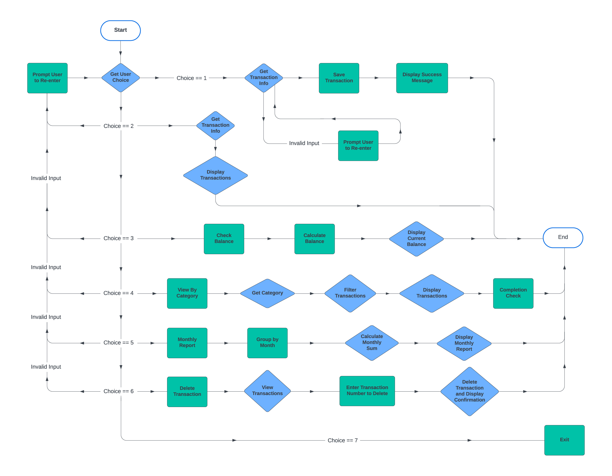

## How the App works:
screenshots of how the app works to be inserted.

## Testing

## Bugs (fixed)

| Bug | Description  | Screenshot | Correction |
| --- |------------- | ----------------- | -----------|
| SyntaxError | Incorrect operator used to check if integer selection | 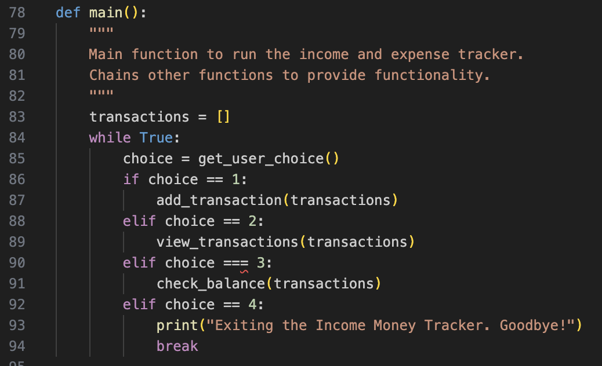 |  |
| KeyError in check_balance function | Incorrect string "formatted_amount" used instead of "amount" | 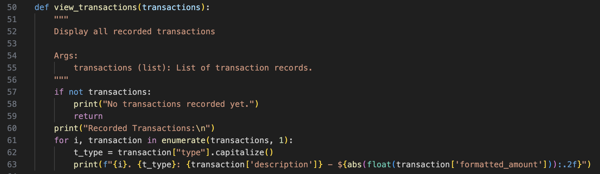 |  |
| KeyError in check_balance function | Incorrect string "formatted_amount" used instead of "amount" |  |  |
| NameError in add_transaction function | The function was incorrectly named as "save_transactions(transaction)" instead of "save_transactions(transactions)" | 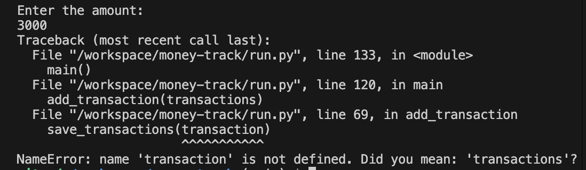 | 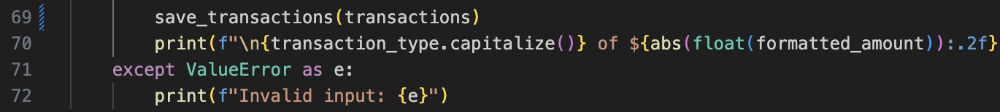 |
| TypeError in view_transactions_by_category function | List indices was a string and not an integer or slice | 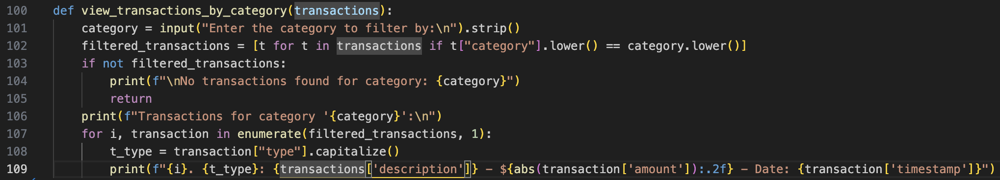 | 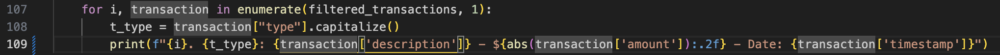 |

## Validation

#### [CI Python validator](https://pep8ci.herokuapp.com/)

| File | screenshot | Notes |                                                                                                 |
| --- | --- | --- | ----------------------------------------------------------------------------------------------------------|
| run.py  | 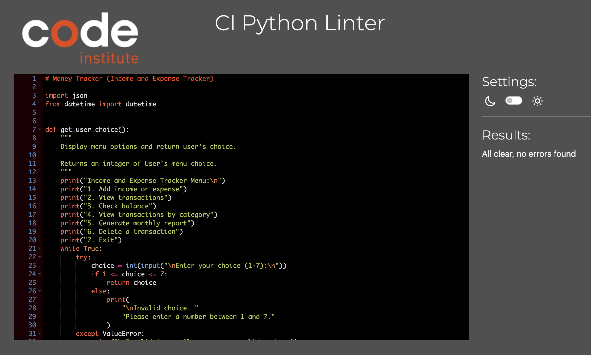 |  All clear, no errors found |

## Tools & Technologies used

The main functions are generated with Python:

- phython
- node.js
- GitHub template reused from love sandwiches
- Gitpod used for local IDE for development
- Git used for version control (git add, git commit, git push)
- Heroku (deployment)
- GitHub Pages used for hosting the deployed front-end site

## Deployment
The site was deployed to a Heroku page using a GitHub repository for data storage.

### Configure Heroku 
The steps to configure Heroku are as follows:

Log in to your account, or set up a new one

Create a new app on Heroku

 

#### Add a buildpack

Next, add a Heroku buildpack to your app. 

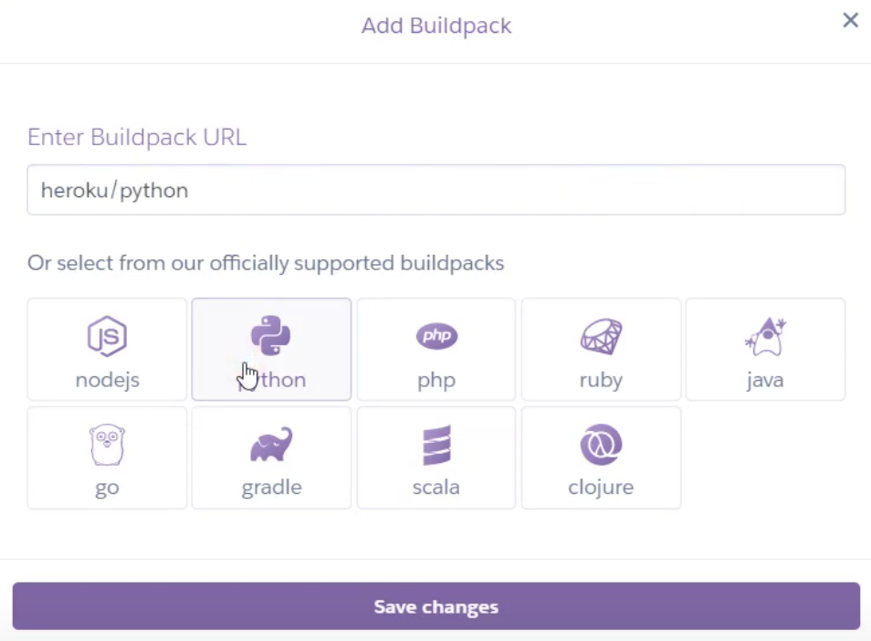

Click add a buildpack to your app and configure it first for Python and then for NodeJS.

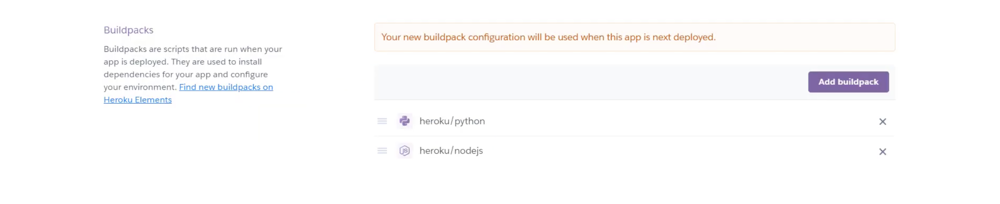

#### Connect to GitHub
Next, you can configure deploys with Github. If you prefer to deploy without using Github, you can read Heroku's deployment ([documentation](https://devcenter.heroku.com/categories/deployment)). 

In the Deploy tab, select the option to Connect this app to GitHub

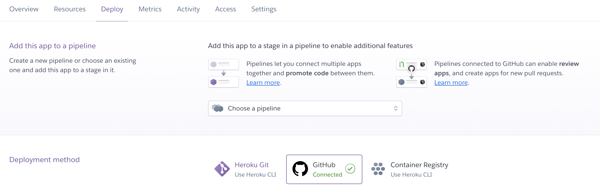

Select the branch you want to deploy your app from

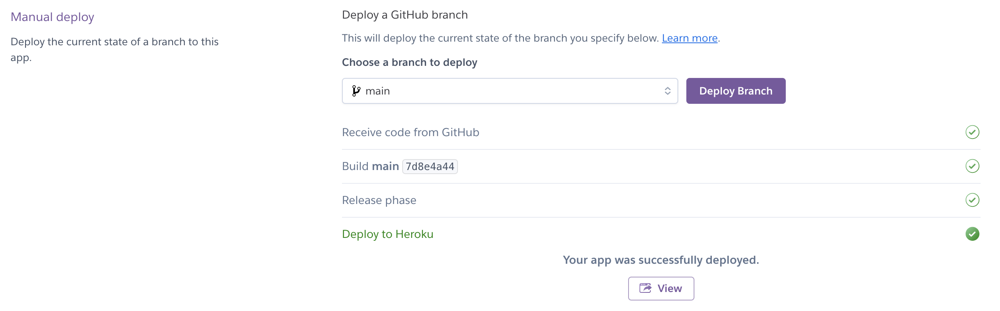

### Accessing deployed project from Github:
- In the Github repository, navigate to the right-hand side, click on the Github pages under the Deployments section.
  
- Under the Github-Pages Deployments section, click on the link to the completed website.

- The live link can be found [here:](https://money-track-0848dea2992f.herokuapp.com/)

## Credits

### Code:

| No | Description  | Source | URL |
| -- | ------------ | ------ | --- |
| 1 | If/Else Statements | w3schools.com | https://www.w3schools.com/python/python_conditions.asp |
| 2 | Loops | Video Tutorial portal stackoverflow.com | https://www.youtube.com/watch?v=zmIdC0_0BgY. https://stackoverflow.com/questions/69827626/python-program-that-loops-until-the-user-says-no-then-will-sum-all-transactions |
| 3 | Try/Except Blocks | Video Tutorial python.org/ | https://www.youtube.com/watch?v=tIh42X0oGQc https://wiki.python.org/moin/HandlingExceptions |
| 4 | Input Validation | Video Tutorial portal stackoverflow.com | https://www.youtube.com/watch?v=LUWyA3m_-r0 https://stackoverflow.com/questions/64669241/how-do-i-validate-a-users-input-and-make-sure-it-is-the-correct-type-and-within |

### Template

The Python Essentials Template from Code Institute was used to create my Github repository:
https://github.com/Code-Institute-Org/p3-template

### Acknowledgements:
My mentor, Rory Sheridan, for his advice and guidance on how to approach this project.