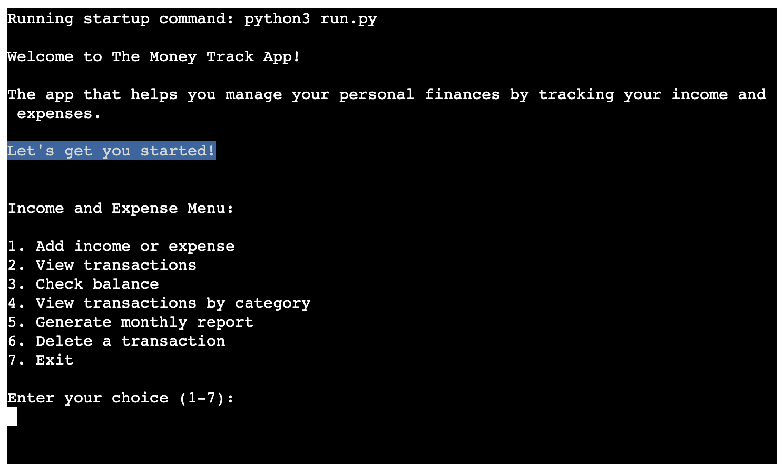
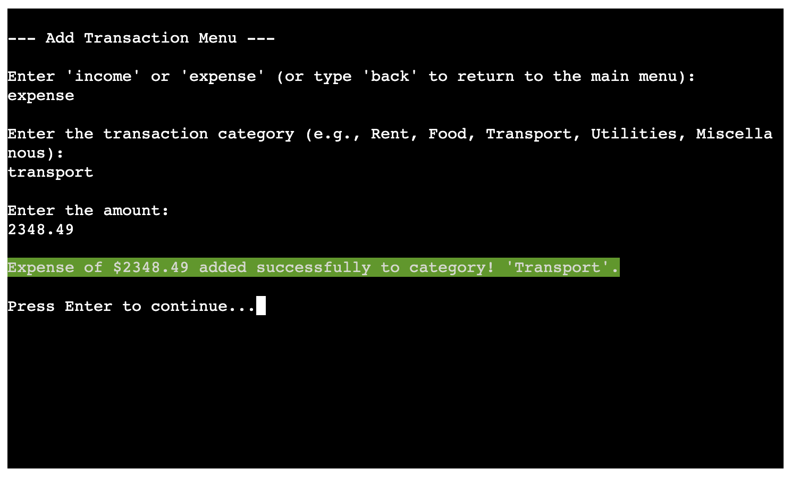
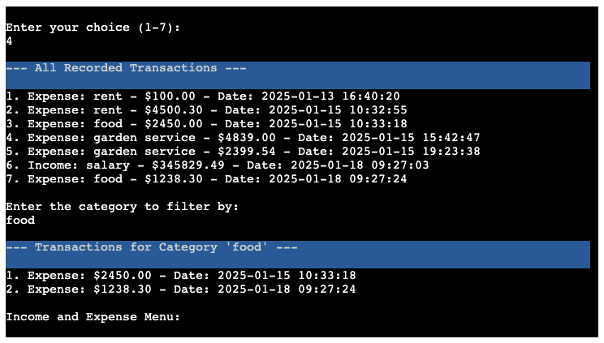
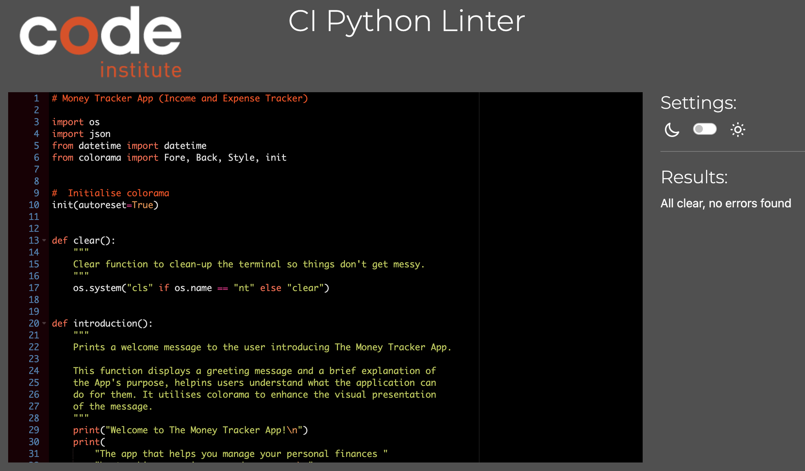

# Money-Track: The Income & Expense Tracker App

The objective of the Money-Track App is a simple and user-friendly income and expense tracking app, allowing users to easily input their income and expenses, categorize their expenses, view their spending history, and generate expense reports. The core mechanic of the app is to keep accurate records of the inflow and outflow of money.

 

[You can view this app here](https://money-track-0848dea2992f.herokuapp.com/)

## User Stories

### New Users:
- As a new user, I would like to keep track of my expenses.
- As a new user, I would like simple and easy to use.
- As a new user, I would like see my all my transactions.
- As a new user, I would like check my balances.

### Return Users:
- As a return user, I would like to keep a monthly track of my income and expenses.

### App Flowchart (created on LucidApp):

Before I started building the app, I mapped out the basic structure of the flowchart and I used LucidApp to create the flowchart.

## How the App works:

##### INITIALIZATION:
- The code imports the neccessary libraries: json, colorama, os and datetime.
- The 'init' function from colorama calls to enable colored text to output in the terminal.
- The 'clear' function defines to clear the terminal screen using os.system for clarity.

##### INTRODUCTION
- The App welcomes the User and introduces itself as The Money Tracker App that helps the User manage their personal finances.

##### MAIN MENU
- The app presents the User with a menu of options:
    1. Add income or expense
    2. View transactions
    3. Check balance
    4. View transactions by category
    5. Generate monthly report
    6. Delete a transaction
    7. Exit

##### RETURN TO 'MAIN MENU'
- The User can return to the 'Main Menu' by typing 'back'

##### USER CHOICE
The App will perform the action the User selected:
- Add income or expense (Option 1)
    - The App will ask the User to specify whether they want to add "income" or "expense".
    - The User can then enter the category of the transaction (e.g., "Salary", "Rent", "Food").
    - The User will be prompted to enter the amount of the transaction.
    - The App will confirm the details and add the transaction to their records.

-----

- View transactions (Option 2)
    - This option will display a list of all their recorded transactions, including the type (income or expense), category, amount, and date.

-----

- Check balance (Option 3)
    - The App will calculate and display their current balance, which is the sum of all their income transactions minus the sum of all their expense transactions.

-----

- View transactions by category (Option 4)
    - The User can view their transactions filtered by a specific category.
    - The App will first display a list of all their transactions.
    - Then, the User will be prompted to enter the category they want to see.
    - The App will then display only the transactions that belong to that category.

-----

- Generate monthly report (Option 5)
    - This option will generate a report that summarizes their income and expenses for each month.
    - The report will show the total amount of income and expenses for each month.

-----

- Delete a transaction (Option 6)
    - The User can delete transactions from their records.
    - The App will first display a list of all their transactions.
    - The User will be prompted to enter the number(s) of the transaction(s) they want to delete.
    - The App will confirm their choice before deleting the transaction(s).

-----

- Exit (Option 7)
    - This option will exit the App.

##### SAVING TRANSACTIONS:
- The App saves the Users transaction data in a file named "transactions.json" whenever they add, edit, or delete a transaction. This ensures that their data is persistent and doesn't disappear when they close the App.

## Testing

## Bugs (fixed)

| Bug | Description  | Screenshot | Correction |
| --- |------------- | ----------------- | -----------|
| SyntaxError | Incorrect operator used to check if integer selection |  |  |
| KeyError in check_balance function | Incorrect string "formatted_amount" used instead of "amount" |  |  |
| KeyError in check_balance function | Incorrect string "formatted_amount" used instead of "amount" |  |  |
| NameError in add_transaction function | The function was incorrectly named as "save_transactions(transaction)" instead of "save_transactions(transactions)" |  |  |
| TypeError in view_transactions_by_category function | List indices was a string and not an integer or slice |  |  |

## Validation

#### [CI Python validator](https://pep8ci.herokuapp.com/)

| File | screenshot | Notes |                                                                                                 |
| --- | --- | --- | ----------------------------------------------------------------------------------------------------------|
| run.py  |  |  All clear, no errors found |

## Tools & Technologies used

The main functions are generated with Python:

- phython
- node.js
- GitHub template reused from love sandwiches
- Gitpod used for local IDE for development
- Git used for version control (git add, git commit, git push)
- Heroku (deployment)
- GitHub Pages used for hosting the deployed front-end site

## Deployment
The site was deployed to a Heroku page using a GitHub repository for data storage.

### Configure Heroku 
The steps to configure Heroku are as follows:

Log in to your account, or set up a new one

Create a new app on Heroku

 

#### Add a buildpack

Next, add a Heroku buildpack to your app. 

Click add a buildpack to your app and configure it first for Python and then for NodeJS.

#### Connect to GitHub
Next, you can configure deploys with Github. If you prefer to deploy without using Github, you can read Heroku's deployment ([documentation](https://devcenter.heroku.com/categories/deployment)). 

In the Deploy tab, select the option to Connect this app to GitHub

Select the branch you want to deploy your app from

### Accessing deployed project from Github:
- In the Github repository, navigate to the right-hand side, click on the Github pages under the Deployments section.
  
- Under the Github-Pages Deployments section, click on the link to the completed website.

- The live link can be found [here:](https://money-track-0848dea2992f.herokuapp.com/)

## Credits

### Code:

| No | Description  | Source | URL |
| -- | ------------ | ------ | --- |
| 1 | If/Else Statements | w3schools.com | https://www.w3schools.com/python/python_conditions.asp |
| 2 | Loops | Video Tutorial portal stackoverflow.com | https://www.youtube.com/watch?v=zmIdC0_0BgY. https://stackoverflow.com/questions/69827626/python-program-that-loops-until-the-user-says-no-then-will-sum-all-transactions |
| 3 | Try/Except Blocks | Video Tutorial python.org/ | https://www.youtube.com/watch?v=tIh42X0oGQc https://wiki.python.org/moin/HandlingExceptions |
| 4 | Input Validation | Video Tutorial portal stackoverflow.com | https://www.youtube.com/watch?v=LUWyA3m_-r0 https://stackoverflow.com/questions/64669241/how-do-i-validate-a-users-input-and-make-sure-it-is-the-correct-type-and-within |
| 5 | Listing recoded data | portal stackoverflow.com | https://stackoverflow.com/questions/65364473/pandas-sorting-transactions-into-categories |

### Template

The Python Essentials Template from Code Institute was used to create my Github repository:
https://github.com/Code-Institute-Org/p3-template

### Acknowledgements:
My mentor, Rory Sheridan, for his advice and guidance on how to approach this project. He also introduced a code snippet to clear the terminal to get rid of any code clutter:

    def clear():
        """
        Clear function to clean-up the terminal so things don't get messy.
        """
        os.system("cls" if os.name == "nt" else "clear")

I have been made aware that my git commit messages are too long and I will address this in my future projects.